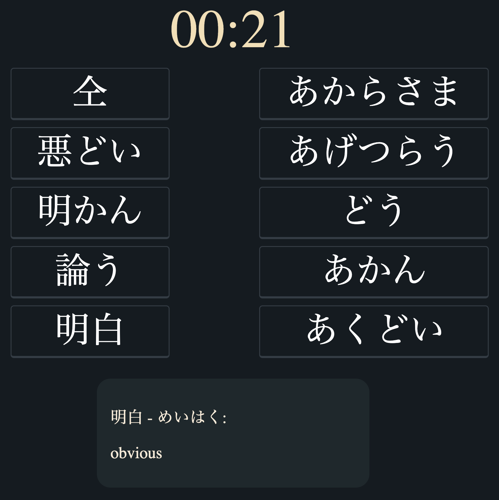

# Match Madness - Japanese Kanji Learning Game
Match Madness is a web-based game inspired by Duolingo's Match Madness game mode, designed to facilitate learning Japanese Kanji in a fun and interactive manner. It allows players to match Kanji characters with their readings by connecting them in pairs.

# Features
Two columns of Kanji characters and their readings.
Connect matching Kanji-reading pairs to see the glossary.

# Future Plans
- Words Madness Mode: Implement a new game mode where a single Kanji character is displayed, and users input its meaning. Points are earned for correct translations.
- Customization Options: Allow users to customize game settings, number of Kanji characters displayed, favourite words for review etc.

# Motivation
The project originated from the need for a more engaging and interactive approach to learning Japanese Kanji. Traditional methods often involve rote memorization, which can be tedious and discouraging. Match Madness aims to provide a gamified learning experience that promotes repeated exposure to Kanji characters in a playful manner.

# Contributing
Contributions to Match Madness are welcome! To contribute:

1. Fork the repository.
2. Clone the forked repository to your local machine.
3. Make your changes.
4. Test your changes thoroughly.
5. Commit your changes with clear, descriptive messages.
6. Push your changes to your forked repository.
7. Submit a pull request with a detailed explanation of your changes.

# Issues
If you encounter any bugs, have suggestions for improvements, or want to discuss features, please submit an issue through the GitHub Issues tab. Your feedback is valuable and helps in enhancing the game for all users.

# Technologies Used
- HTML5
- CSS3
- JavaScript (Vanilla)

# Credits
This project was created by Marcin Majka. Special thanks to Duolingo for the inspiration.